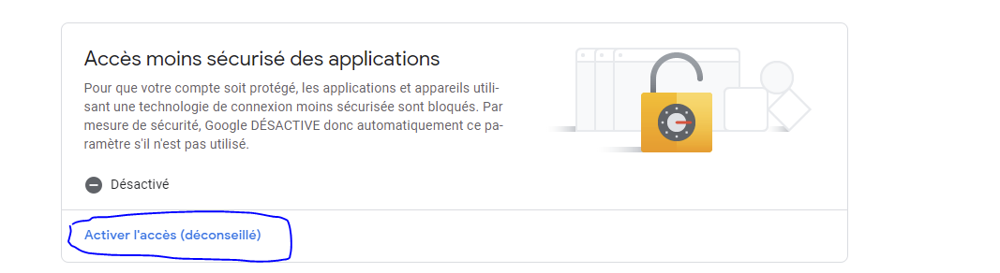
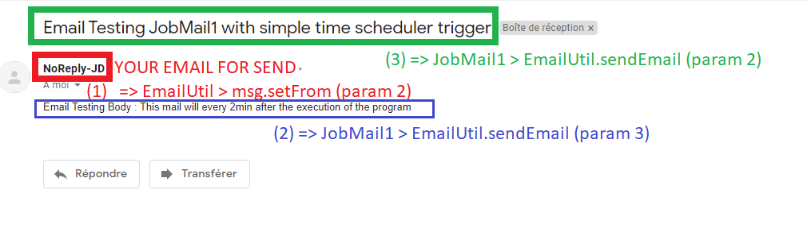

# Send mail using java :

<br>

Official documentation :
[Send mail using smtp](https://support.google.com/a/answer/176600?hl=fr#zippy=%2Cutiliser-le-serveur-smtp-gmail%2Cutiliser-le-serveur-smtp-gmail-restreint)

Try with a simple gmail account :
* You should configure your Email account first : https://myaccount.google.com/security (Source : https://waytolearnx.com/2020/03/envoyer-un-mail-avec-java-en-utilisant-gmail.html)



<br>

Parameter :
* EmailUtil.java : 
```java
		  final String fromEmail = "Email_for_sending_using_SMTP"; //requires valid gmail id
		  final String password = "PASSWORD_for_fromEmail_account"; // correct password for gmail id
```

and :
JobMail1.java
```java
		String sendTo = "Email";
		EmailUtil.sendEmail(sendTo,
				"Email Testing JobMail1 with simple time scheduler trigger", 
				"Email Testing Body : This mail will every 2min after the execution of the program");
		
```

<br>

Result : projet Quartz-JavaMail



<br>

An other possibiliy will be to use the job : SendMailJob wich is a job already implemented inside Quartz :
```java
		/**
		 * 
		 * @param host
		 * @param sender
		 * @param recipient
		 * @param Subject
		 * @param message
		 */
		public void send_mail(String host, String sender, String recipient, String Subject, String message)
		{
			JobDataMap map = new JobDataMap(); 
			map.put(SendMailJob.PROP_SMTP_HOST,host); 
			map.put(SendMailJob.PROP_SENDER,sender); 
			map.put(SendMailJob.PROP_RECIPIENT,recipient); 
			map.put(SendMailJob.PROP_SUBJECT,Subject); 
			map.put(SendMailJob.PROP_MESSAGE,message); 
			JobDetail job = JobBuilder.newJob(SendMailJob.class).usingJobData(map).build();
			Trigger t1 = TriggerBuilder.newTrigger().startNow().build();

			Scheduler sc;
			try {
				sc = StdSchedulerFactory.getDefaultScheduler();
				sc.start();
				sc.scheduleJob(job, t1);
			} catch (SchedulerException e) {
				// TODO Auto-generated catch block
				e.printStackTrace();
			}
		}
```

<br>
<br>

That's also possible using emaiyili in R for example, one of the advantage of Emayili is that you can use markdown synthax for generate your email so you have a really great tool for sending complex email with graph, report etc... : 
* [emayili link](https://datawookie.github.io/emayili/index.html)
* [youtube presentation : 2021-09-16 — {emayili} — BirminghamR](https://www.youtube.com/watch?v=9Qp1SPFuGfA)
* [youtube presentation : September 2021 - COVID-19 dashboards & Emailing with R](https://www.youtube.com/watch?v=U5kxEcnSuwE)

<br>

Other option exist but i want to learn more about emayili because i find the feature really interesting and R is used for data analysis so to be able to generate report in markdown file and automating the send of this document directly inside a proper email can be nice. 