# 🚀 Handling mail centralisation (Gmail, Outlook) 🚀 <!-- omit in TOC --> 

<div align="center">


</div>

- [Create mail filter](#create-mail-filter)
  - [Gmail](#gmail)
    - [Filter Alert message](#filter-alert-message)
    - [Filter meet message](#filter-meet-message)
    - [Note](#note)
    - [Filter forwaded message](#filter-forwaded-message)
  - [Outlook](#outlook)
    - [Create filter and perform automatics action](#create-filter-and-perform-automatics-action)
- [Mail redirection](#mail-redirection)
  - [Gmail](#gmail-1)
  - [Outlook](#outlook-1)
- [Sound notification](#sound-notification)
  - [Gmail](#gmail-2)
  - [Outlook](#outlook-2)
- [Send Automating Email using Java](#send-automating-email-using-java)
  - [Quick started :](#quick-started-)

<br>
<br>

___
# Create mail filter 
## Gmail 
### Filter Alert message
Create filter for separate ALERT email and normal mail so your Gmail keep clean and easy to find important mail.

<details>
<summary>step 1 : Create a new label (1/2) - click on create a label </summary>

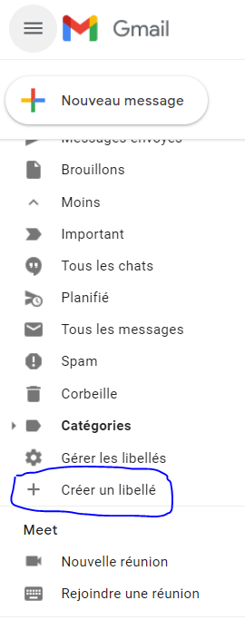

<br>
</details>

<details>
<summary>step 2 : Create a new label (2/2) - enter name ALERT</summary>

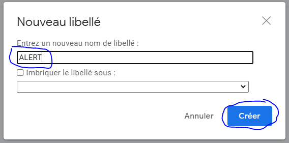

<br>
</details>

<details>
<summary>step 3 : Click on mail you want to filter then filter message like this</summary>

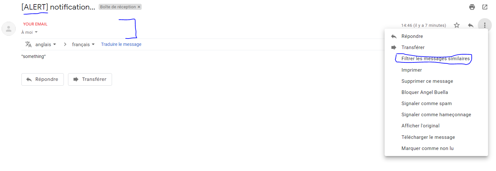

<br>
</details>

<details>
<summary>step 4 : Configure filter (1/2)</summary>

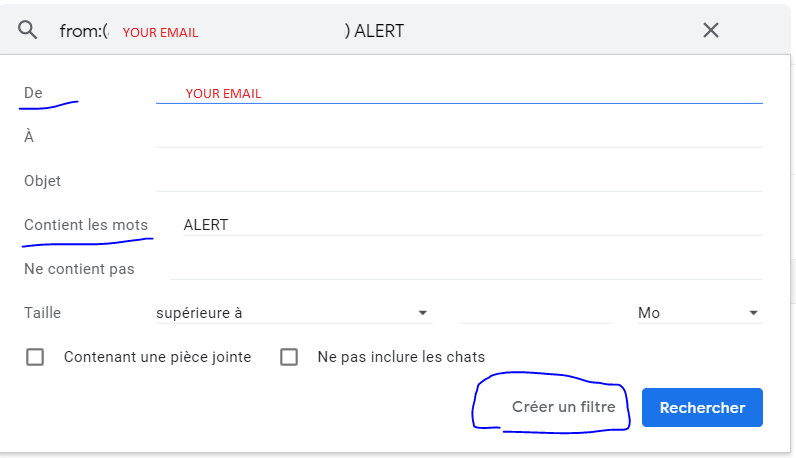

<br>
</details>

<details>
<summary>step 5 : Configure filter (2/2)</summary>

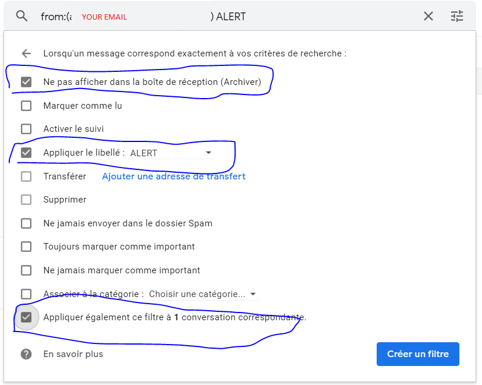

Option :
|french|english|
|---|---|
|Ne pas afficher dans la boîte de réception (Archiver)|Skip the Inbox (Archive it)|
|Marquer comme lu|Mark as read|
|Activer le suivi|Star it|
|Appliquer le libellé :|Apply the label|
|Transférer|Transfert it|
|Supprimer|Delete it|
|Ne jamais envoyer dans le dossier Spam|Never send it to Spam|
|Toujours marquer comme important|Always mark it as important|
|Ne jamais marquer comme important|Never mark it as important|
|Associer à la catégorie :|Categorize as:|
|Appliquer également ce filtre à 1 conversation correspondante.|Also apply filter to matching conversations|

<br>
</details>

<br>
<br>

### Filter meet message
Create filter for separate invitation to meeting email. So you keep your email clean for other message and can access meeting email easier.

<details>
<summary>step 1</summary>

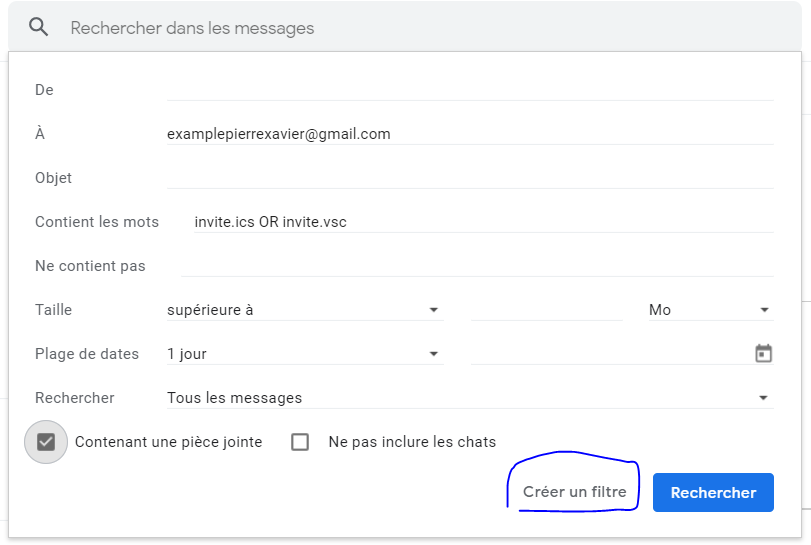
* To : __``Your email``__ instead of __``examplepierrexavier@gmail.com``__
* Has the words : __``invite.ics OR invite.vsc``__

Click On Create filter

<br>
</details>

<details>
<summary>step 2</summary>

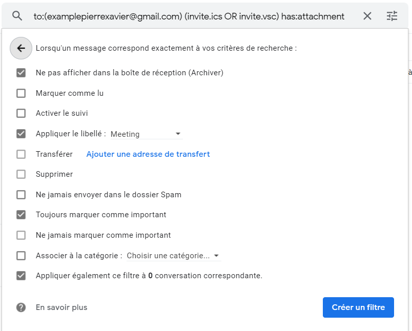

other option :
|french|english|
|---|---|
|Ne pas afficher dans la boîte de réception (Archiver)|Skip the Inbox (Archive it)|
|Marquer comme lu|Mark as read|
|Activer le suivi|Star it|
|Appliquer le libellé :|Apply the label|
|Transférer|Transfert it|
|Supprimer|Delete it|
|Ne jamais envoyer dans le dossier Spam|Never send it to Spam|
|Toujours marquer comme important|Always mark it as important|
|Ne jamais marquer comme important|Never mark it as important|
|Associer à la catégorie :|Categorize as:|
|Appliquer également ce filtre à 1 conversation correspondante.|Also apply filter to matching conversations|

<br>
</details>

<details>
<summary>step 3</summary>

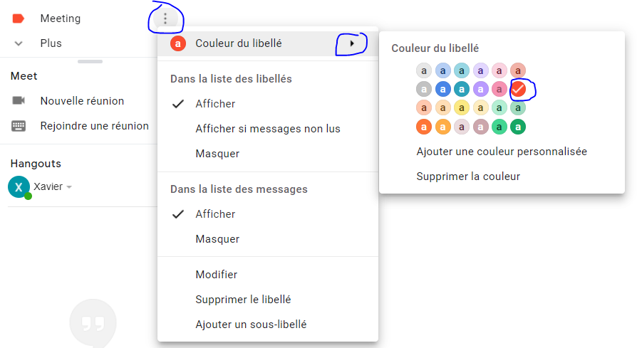

Change color label if you want for differentiate the different labels more easily.

<br>
</details>

<br>

### Note 
You can also create sublabel and perform filter inside mail already filtered for creating categorie for the forwarded email.

<br>
<br>

### Filter forwaded message
Create a filter for separate forwarded mail to our companie email.

<details>
<summary>step 1</summary>

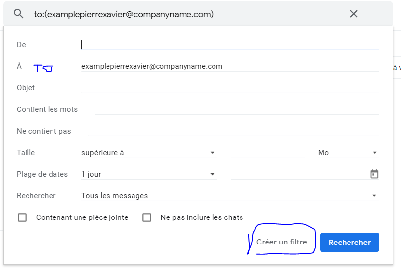
* To : the email destination for the message so in this example I'm filtering mail coming from __``email_address_from_where_your_message_are_forwarded``__ (examplepierrexavier@companyname.com)

click on create filter

<br>
</details>

<details>
<summary>step 2</summary>

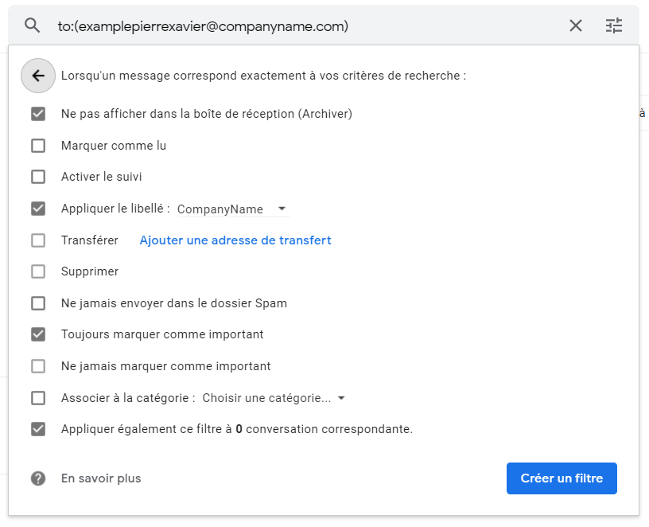
* skip in the inbox and always mark it as important is optional depend on your preference 
* Apply the label here "compani name" because i filtering message coming from me

<br>
</details>


<br>
<br>


___

## Outlook
### Create filter and perform automatics action

<details>
<summary>step 1</summary>

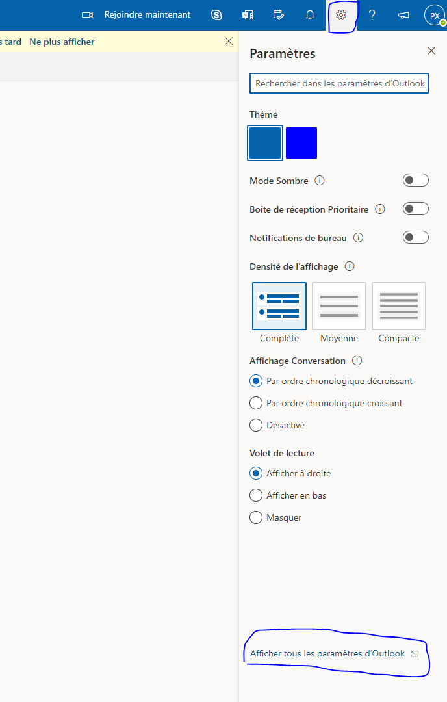


<br>
</details>

<details>
<summary>step 2</summary>

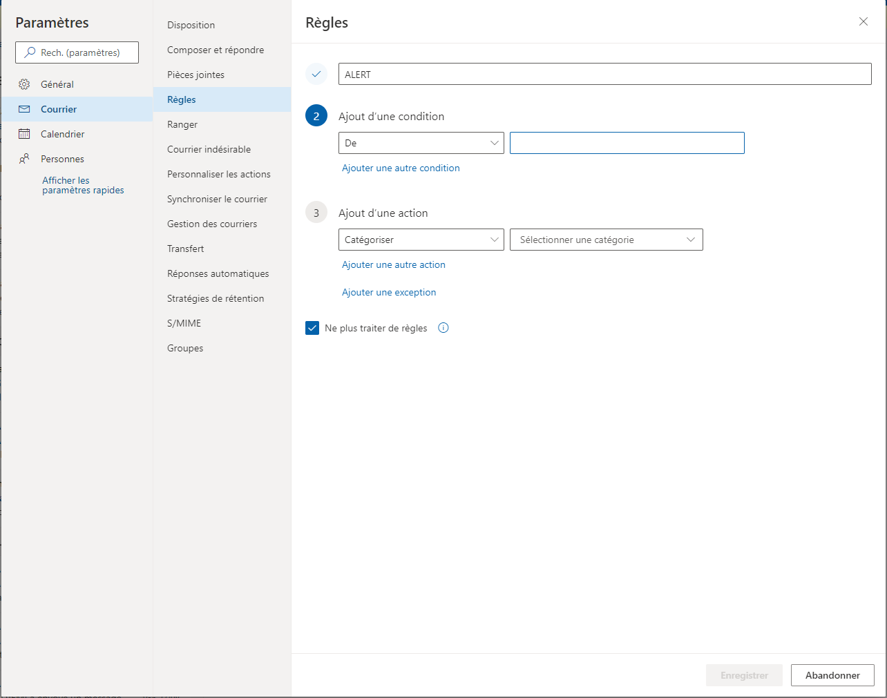

* Edit condition and action as your please

Click On Save 

<br>
</details>

<br>
<br>
<br>

___

# Mail redirection


## Gmail

We can transfert email from gmail account to an other email.

<details>
<summary>step 1</summary>

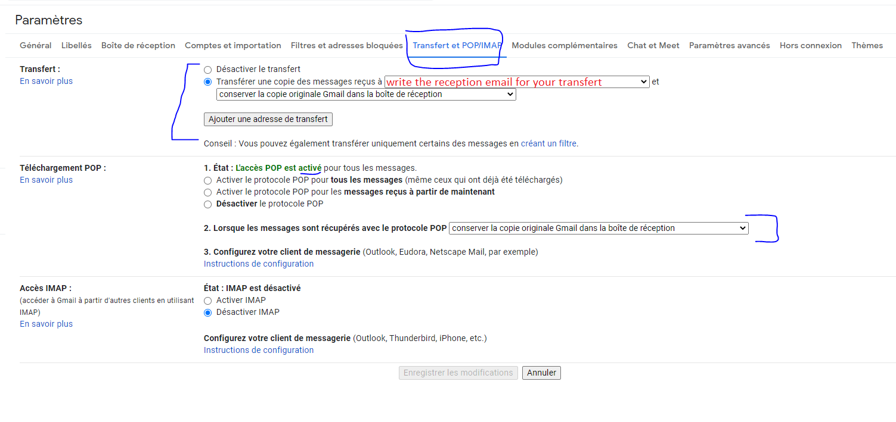


<br>
</details>


<br>
<br>

## Outlook

If you want redirect email from our outlook address, so you can automatically send it to y our companie gmail address. You can have everything inside one place then create some filter on it to keep the mail properly shorted.

<details>
<summary>step 1</summary>


<br>
</details>

<details>
<summary>step 2</summary>

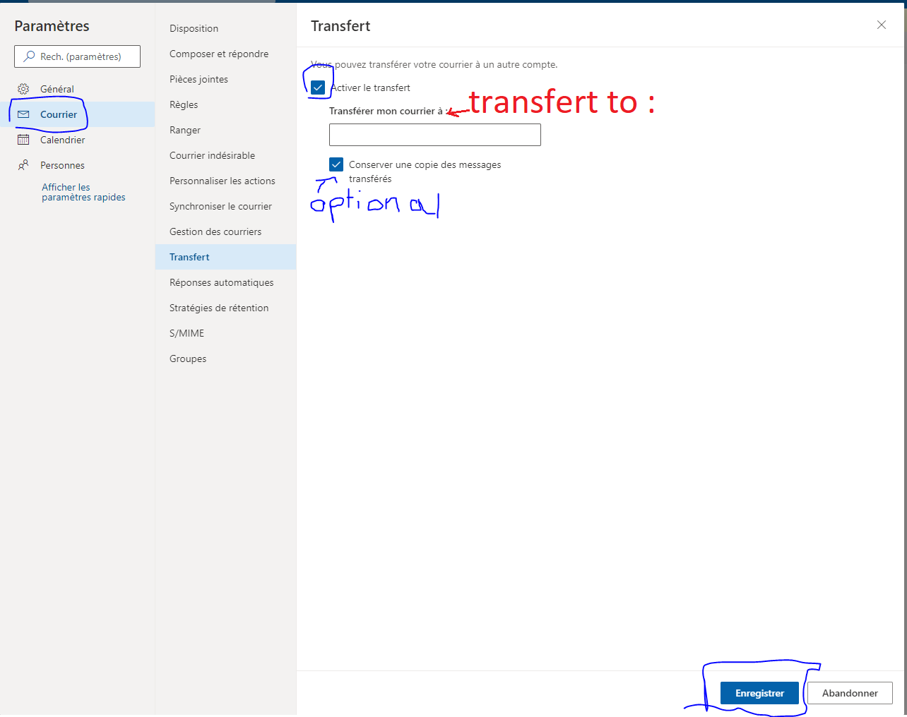

* To : __``Your email``__

Click On Save 

<br>
</details>

<br>

Note :

(Depending on security rules) When an email is send by an address to an other email, this email can't be forwarded so you should filter this kind of mail on outlook for not missing them,that's why sound and notification can help too.


<br>
<br>
<br>

___

# Sound notification
## Gmail

That's not possible to setup sound notification for gmail when we receive an email, the only option is too use a third party extension according to this [article](https://www.lifewire.com/how-to-change-the-new-mail-sound-for-gmail-1171986) 

<br>
<br>

## Outlook 

<details>
<summary>step 1</summary>

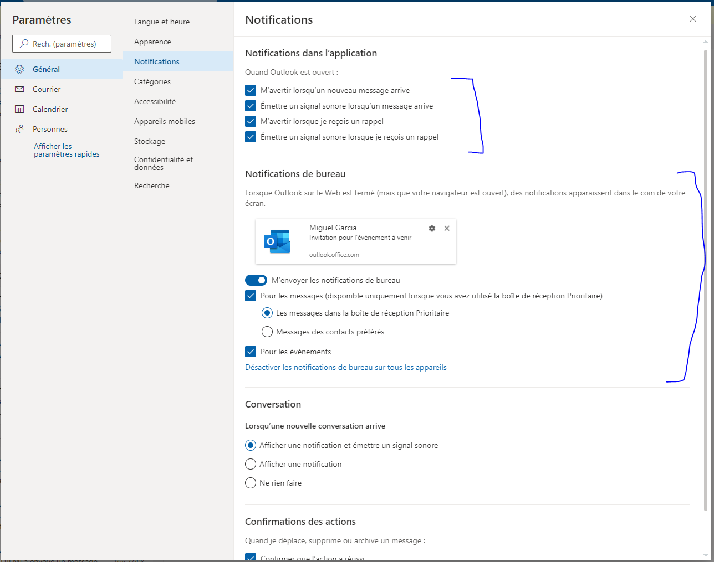


<br>
</details>

<br>
<br>

___

# Send Automating Email using Java

Just a little POC for sending automating email using java (javamail) and quartz for scheduling email.

## Quick started :
Official documentation :
[Send mail using smtp](https://support.google.com/a/answer/176600?hl=fr#zippy=%2Cutiliser-le-serveur-smtp-gmail%2Cutiliser-le-serveur-smtp-gmail-restreint)

Try with a simple gmail account :
* You should configure your Email account first : https://myaccount.google.com/security (Source : https://waytolearnx.com/2020/03/envoyer-un-mail-avec-java-en-utilisant-gmail.html)


<br>

Parameter :
* EmailUtil.java : 
```java
		  final String fromEmail = "Email_for_sending_using_SMTP"; //requires valid gmail id
		  final String password = "PASSWORD_for_fromEmail_account"; // correct password for gmail id
```

and :
JobMail1.java
```java
		String sendTo = "Email";
		EmailUtil.sendEmail(sendTo,
				"Email Testing JobMail1 with simple time scheduler trigger", 
				"Email Testing Body : This mail will every 2min after the execution of the program");
		
```

<br>

Result : projet Quartz-JavaMail


<br>

An other possibiliy will be to use the job : SendMailJob wich is a job already implemented inside Quartz :
```java
		/**
		 * 
		 * @param host
		 * @param sender
		 * @param recipient
		 * @param Subject
		 * @param message
		 */
		public void send_mail(String host, String sender, String recipient, String Subject, String message)
		{
			JobDataMap map = new JobDataMap(); 
			map.put(SendMailJob.PROP_SMTP_HOST,host); 
			map.put(SendMailJob.PROP_SENDER,sender); 
			map.put(SendMailJob.PROP_RECIPIENT,recipient); 
			map.put(SendMailJob.PROP_SUBJECT,Subject); 
			map.put(SendMailJob.PROP_MESSAGE,message); 
			JobDetail job = JobBuilder.newJob(SendMailJob.class).usingJobData(map).build();
			Trigger t1 = TriggerBuilder.newTrigger().startNow().build();

			Scheduler sc;
			try {
				sc = StdSchedulerFactory.getDefaultScheduler();
				sc.start();
				sc.scheduleJob(job, t1);
			} catch (SchedulerException e) {
				// TODO Auto-generated catch block
				e.printStackTrace();
			}
		}
```

<br>
<br>

That's also possible using emaiyili in R for example, one of the advantage of Emayili is that you can use markdown synthax for generate your email so you have a really great tool for sending complex email with graph, report etc... : 
* [emayili link](https://datawookie.github.io/emayili/index.html)
* [youtube presentation : 2021-09-16 — {emayili} — BirminghamR](https://www.youtube.com/watch?v=9Qp1SPFuGfA)
* [youtube presentation : September 2021 - COVID-19 dashboards & Emailing with R](https://www.youtube.com/watch?v=U5kxEcnSuwE)

<br>

Other option exist but i want to learn more about emayili because i find the feature really interesting and R is used for data analysis so to be able to generate report in markdown file and automating the send of this document directly inside a proper email can be nice. 
